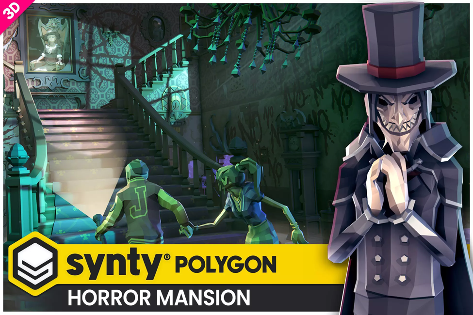
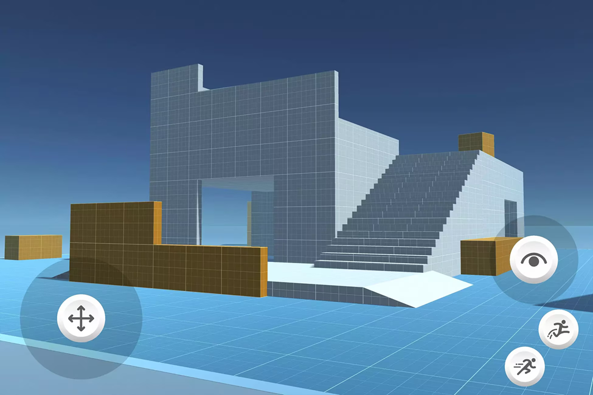
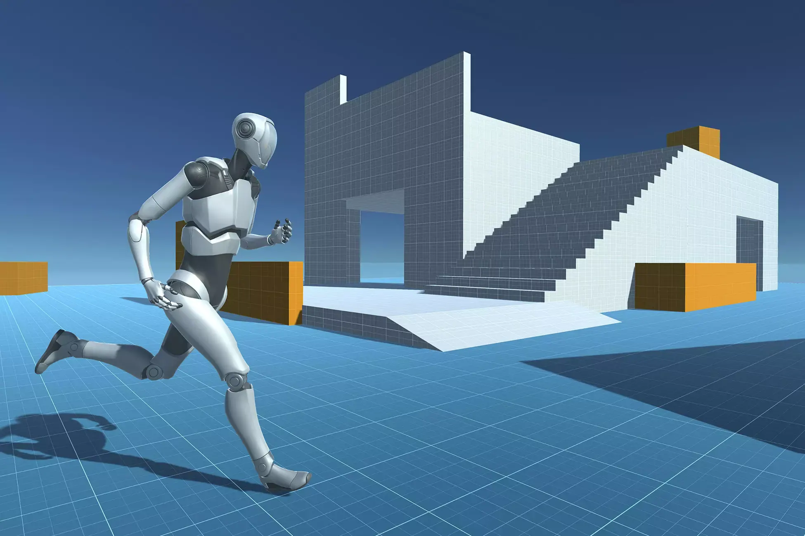
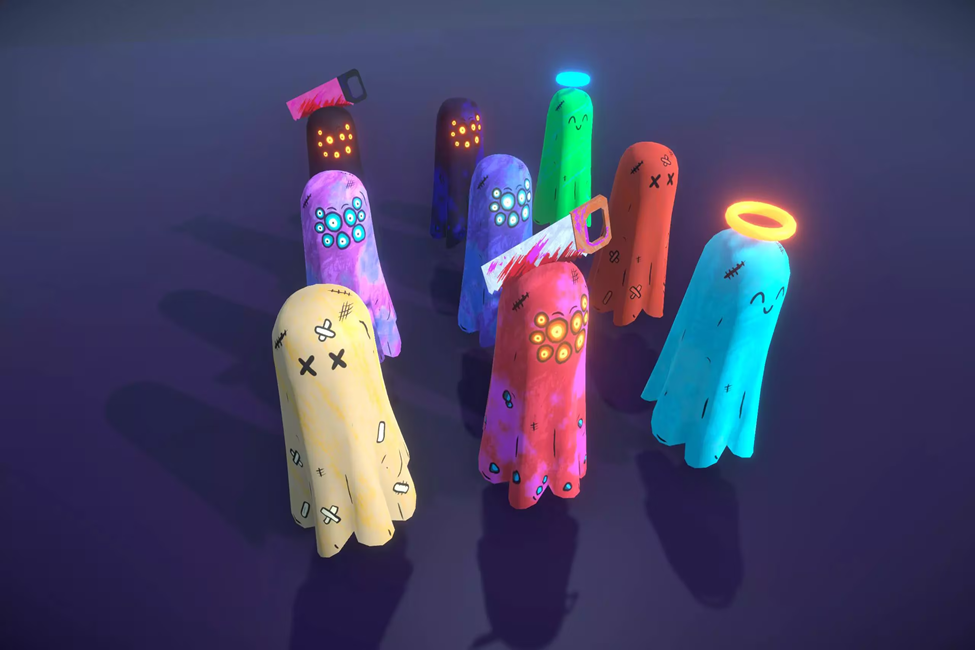
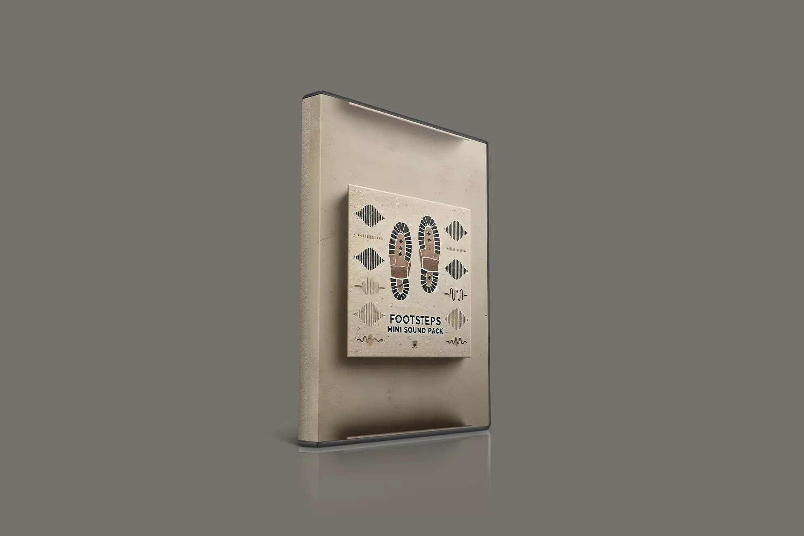
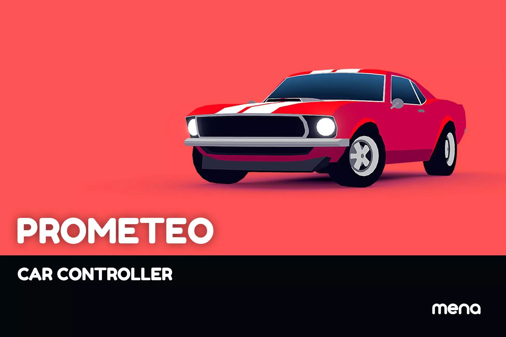
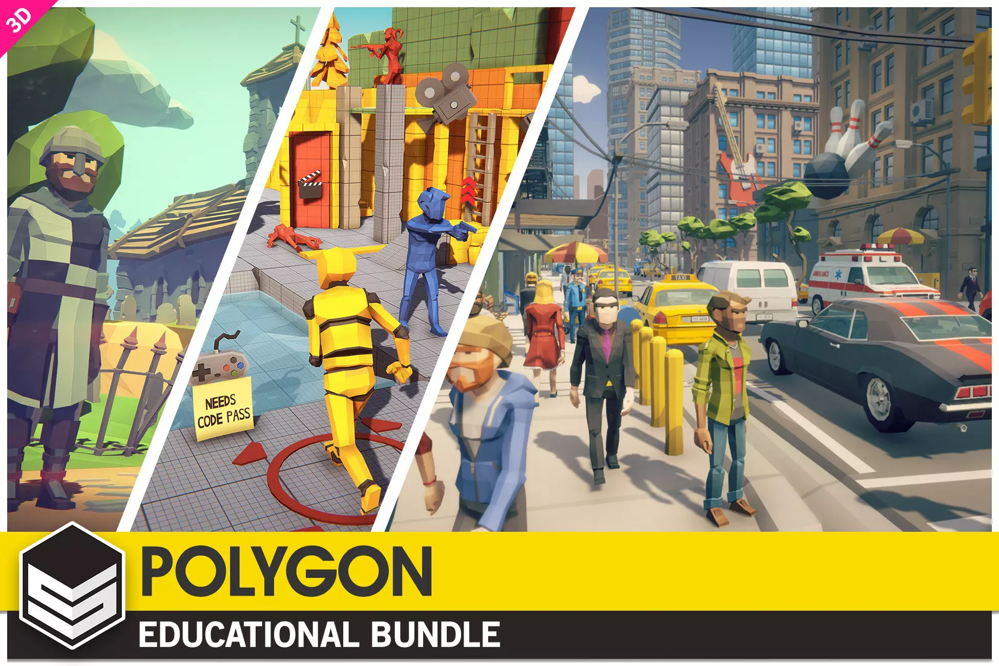

# 🌌 Where Darkness Took Them

## Démo du jeu :

[)

https://www.youtube.com/watch?v=2dAnTD_pAfQ

## 📌 Description

Projet de jeu réalisé dans le cadre de la E3 à ESIEE Paris. Il s’agit d’un jeu d’exploration (et d’horreur) où le joueur doit retrouver des fragments de sa mémoire un manoir afin de pouvoir s’enfuir.

## 📚 Lore et Sens profond

Notre jeu comporte une Histoire à double sens. En effet dans cette première partie le personnage est comme attiré par le Manoir ou il y aurait vu son enfant enfermé. La suite de l’histoire est simple il s’y rend fait un malencontreux accident avant de se réveiller dans une pièce fermée de ce même bâtiment. A travers le gameplay notre protagoniste cherchera à s’échapper du manoir grâce à l’aide d’une âme perdue avant de se faire capturer par des démons à la sortie. 

Nous avons chercher ici à aller au delà du traditionnel jeu d’horreur grâce à des inspirations tel que *Five Nights At Freddy’s* ou *Fears to Fathom* où l’on trouve souvent un sens plus profond à l’histoire. Ici les concepts d’images mental d’enfants, le manoir et ces démons sont bien plus métaphoriques que le joueur pourrait l’interpréter. Ces images et cette attraction pour l’endroit hanté sont en réalités l’image d’une folie profonde du personnage qui cherche à revivre son enfance damnée et non pas sauver son propre enfant. Le manoir correspond en réalité à l’hôpital psychiatrique dont il n’a jamais réussi à s’échapper. L’âme errante et les démons sont des reflets de ses émotions profondes et son état mental.

Toutefois rien n’est laissé au hasard et plusieurs éléments du jeu sous entendent ce double sens. Les fragments sont des images mémoires cachées derrière des masques, les cinématiques et le story telling du mode histoire sous entendent également que l’attraction pour ce lieu restent inexpliqué et seraient donc potentiellement plus lourd de sens que prévu. Plusieurs easter egg également sur le menu du jeu montre que ses démons le tourmentent et le suivent partout (jusqu’au menu du jeu lui même).

## 🛠 Technologies utilisées
- **Moteur de jeu :** Unity  
- **Langage de programmation :** C#  

## 🎨 Assets
- [Polygon Horror Mansion (Synty)](https://assetstore.unity.com/packages/3d/environments/fantasy/polygon-horror-mansion-low-poly-3d-art-by-synty-213346)  

  

- [Starter Assets - FirstPerson | Updates in new CharacterController package](https://assetstore.unity.com/packages/essentials/starter-assets-firstperson-updates-in-new-charactercontroller-pa-196525)  

  

- [Starter Assets - ThirdPerson | Updates in new CharacterController package](https://assetstore.unity.com/packages/essentials/starter-assets-thirdperson-updates-in-new-charactercontroller-pa-196526)  

  

- [Cute Monster Ghost's FREE](https://assetstore.unity.com/packages/3d/characters/creatures/cute-monster-ghost-s-free-308550)  

  

- [Footstep mini-pack](https://assetstore.unity.com/packages/audio/sound-fx/foley/footsteps-mini-sound-pack-307682)  

  

- [Wooden Planks](https://assetstore.unity.com/packages/3d/props/industrial/wooden-planks-various-308365)  

  

- [PROMETEO : Car Controller](https://assetstore.unity.com/packages/tools/physics/prometeo-car-controller-209444)  

  

- [POLYGON - Sampler Pack](https://assetstore.unity.com/packages/3d/environments/polygon-sampler-pack-207048)  

  

## 🎮 Comment jouer ?

1. Télécharger sur Github la release du jeu 
2. Dézipper l’archive 
3. Lancer l’exécutable Unity_Project.exe

## 👥 Équipe

- AUBRY Mathias - Développeur / Game dev
- MELIANI Samy - Développeur / Game dev / Music Artist

## 📜 Licence & Crédits

- Ce projet est réalisé dans un cadre éducatif et n’est pas destiné à une diffusion commerciale.
- Les assets utilisés appartiennent à leurs créateurs respectifs et sont utilisés sous licence appropriée.
- Nous remercions également APPUDURAI Achveiya, étudiante à ESIEE Paris en E3E pour nous avoir prêté sa voix pour les dialogues du PNJ.
- Nous remercions Badr TAJINI pour nous avoir proposé ce projet.
